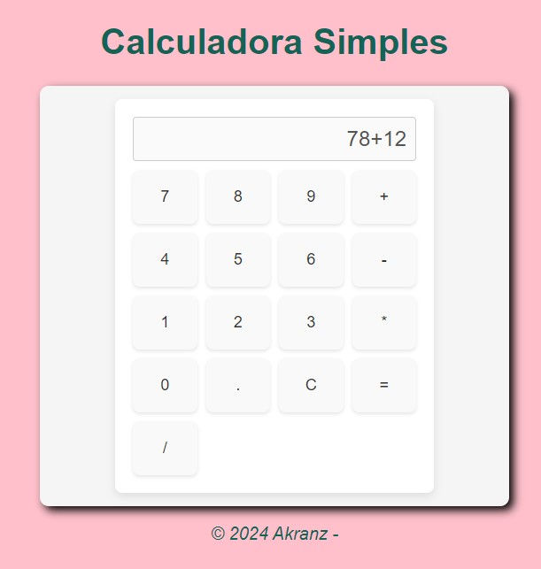

# Calculadora
 Calculadora JS, atividade curso Otterwise

 ## NewCalculator

 Pegando a base do exercicio criada pela Kátia, eu acrescentei as funcionalidades da calculadora em javaScript e reestilizei em CSS a interface. 🙂

Abaixo, dois prints da interface original e reestilizada.

